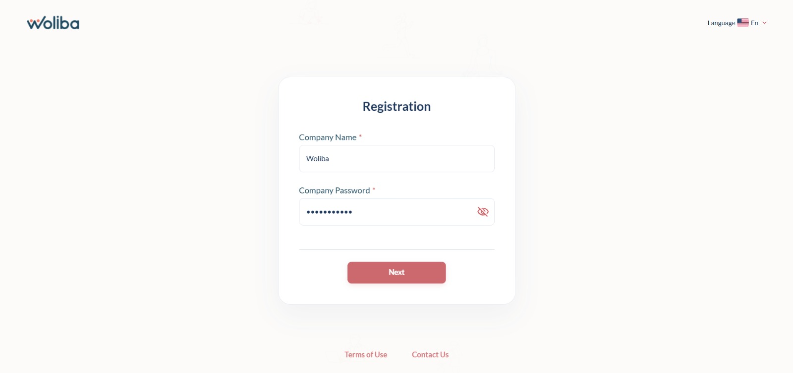
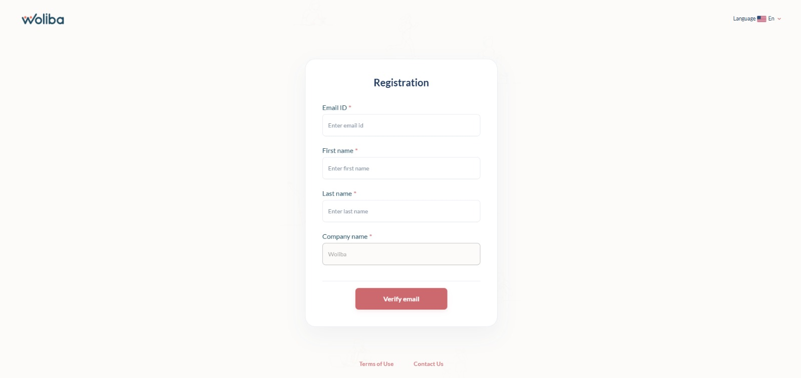
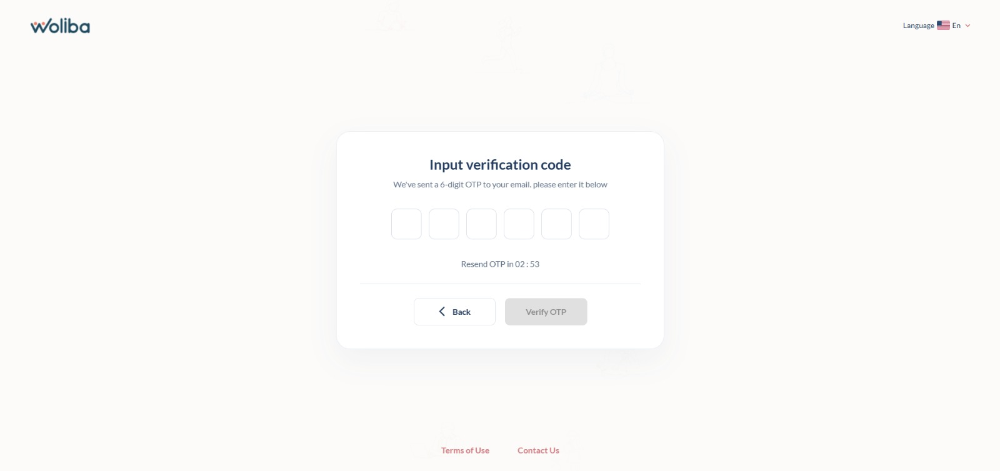
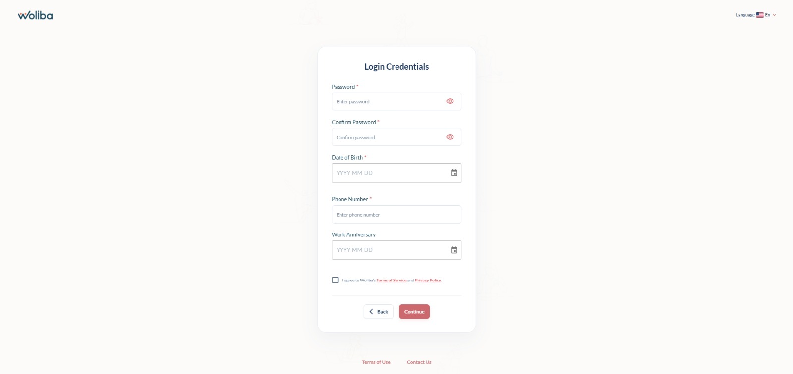
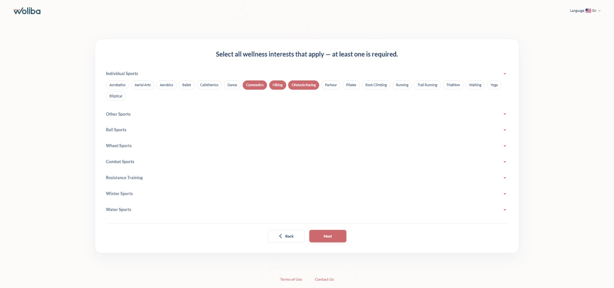
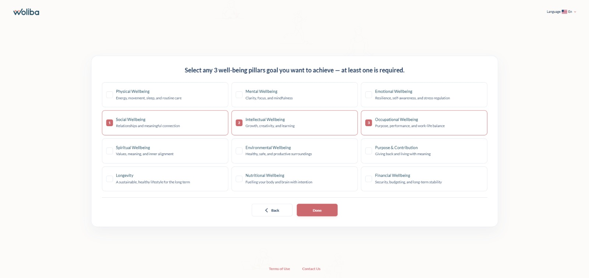

<div align="center">
  

  <h1>Woliba Frontend</h1>

  <p>A multi-step user registration web application for the <strong>Woliba</strong> wellness platform. Built with React 19, Vite, Material UI, and Redux Toolkit, it guides new employees through a structured onboarding flow — from company verification to personalised wellness preferences.</p>


</div>

---

## Table of Contents

- [Overview](#overview)
- [Screenshots](#screenshots)
- [Tech Stack](#tech-stack)
- [Project Structure](#project-structure)
- [Registration Flow](#registration-flow)
- [Getting Started](#getting-started)
- [Environment & Configuration](#environment--configuration)
- [Available Scripts](#available-scripts)
- [State Management](#state-management)
- [API Integration](#api-integration)
- [Routing & Guards](#routing--guards)
- [Error Handling](#error-handling)
- [Component Library](#component-library)
- [Testing](#testing)

---

## Overview

Woliba is a corporate wellness platform. This frontend handles the complete **user registration journey**, broken into 7 sequential steps with guard-based navigation to ensure users cannot skip ahead in the flow. A 10-minute session timer begins after OTP verification to enforce timely completion of registration.

---

## Screenshots

| Step 1 — Company Verification | Step 2 — User Details |
|---|---|
|  |  |

| Step 3 — OTP Verification | Step 4 — Login Credentials |
|---|---|
|  |  |

| Step 5 — Wellness Selector | Step 6 — Wellbeing Pillars |
|---|---|
|  |  |

| Step 7 — Welcome |
|---|
|  |

---

## Tech Stack

| Category | Technology |
|---|---|
| Framework | React 19 |
| Build Tool | Vite 6 |
| UI Library | Material UI (MUI) v9 |
| State Management | Redux Toolkit + React-Redux |
| Routing | React Router DOM v7 |
| Forms & Validation | Formik + Yup |
| HTTP Client | Axios |
| Date Handling | Day.js + MUI X Date Pickers |
| Testing | Vitest + React Testing Library |
| Fonts | Lato (@fontsource/lato) |

---

## Project Structure

```
src/
├── App.jsx                        # Root component — theme, store, router
├── main.jsx                       # Entry point
│
├── assets/
│   ├── images/                    # Logo, background, loader video
│   └── theme/
│       ├── base/palette.js        # Brand colour tokens
│       ├── base/typography.js     # Font configuration
│       └── index.js               # MUI theme composition
│
├── components/                    # Reusable MD-prefixed UI components
│   ├── ErrorBoundary/             # Catches and handles render errors
│   ├── MDAlert/                   # Alert/notification component
│   ├── MDButton/                  # Styled button
│   ├── MDDatePicker/              # Date picker wrapper
│   ├── MDFormCard/                # Card wrapper for form pages
│   ├── MDFormField/               # Text input with Formik integration
│   ├── MDLoader/                  # Animated loader (uses Loader.mp4)
│   ├── MDLoadingButton/           # Button with loading state
│   └── MDTypography/              # Typography wrapper
│
├── guards/                        # Route guards
│   ├── RegistrationGuard.jsx      # Redirects completed registrations
│   └── StepGuard.jsx              # Prevents skipping steps
│
├── hooks/
│   └── useRegistrationTimer.js    # Countdown timer hook (10-min window)
│
├── layouts/
│   ├── DashboardLayout/           # Outer layout shell
│   ├── DashboardNavbar/           # Top navigation bar
│   └── Footer/                   # Page footer
│
├── pages/
│   ├── CompanyVerification/       # Step 1 — verify company name & password
│   ├── UserDetailsVerification/   # Step 2 — collect name & email, send OTP
│   ├── OtpVerification/           # Step 3 — verify OTP (with resend + timer)
│   ├── LoginCredentials/          # Step 4 — set password & profile details
│   ├── WellnessSelector/          # Step 5 — choose wellness interests
│   ├── WellBeingPillars/          # Step 6 — select up to 3 wellbeing pillars
│   └── welcome/                   # Step 7 — success/welcome screen
│
├── redux/
│   ├── api/api.js                 # Axios instance with base URL + proxy
│   ├── hooks.js                   # Typed useAppDispatch / useAppSelector
│   ├── store.js                   # Redux store configuration
│   ├── selectors/
│   │   └── registrationSelectors.js  # Memoised state selectors
│   ├── slices/
│   │   └── registrationSlice.js   # Registration state + reducers
│   └── thunks/
│       └── registrationThunks.js  # Async API thunks
│
├── routes/
│   └── registrationRoutes.jsx     # Route definitions with guard config
│
├── styles/
│   └── index.css                  # Global styles
│
└── utils/
    └── validator.js               # Shared validation helpers
```

---

## Registration Flow

The onboarding is a strictly ordered, 7-step flow. Each step is guarded — users who attempt to navigate directly to a later step are redirected to the appropriate earlier step.

```
/register/company-verification          (Step 1 — entry point)
        ↓  Company ID confirmed
/register/user-details-verification    (Step 2)
        ↓  OTP dispatched to email
/register/otp-verification             (Step 3 — 10-min timer starts on success)
        ↓  OTP verified
/register/login-credentials            (Step 4)
        ↓
/register/wellness-selector            (Step 5)
        ↓
/register/wellbeing-pillars            (Step 6 — max 3 pillars selectable)
        ↓  Registration submitted
/welcome                               (Step 7 — completion screen)
```

Any unknown route redirects to `/register/company-verification`.

---

## Getting Started

### Prerequisites

- **Node.js** v18 or later
- **npm** v9 or later

### Installation

```bash
# Clone the repository
git clone <repository-url>
cd Woliba

# Install dependencies
npm install
```

### Environment Setup

Copy the example env file and set your API URL:

```bash
cp .env.example .env
```

`.env.example`:
```
VITE_API_BASE_URL=https://dev.api.woliba.io/v1
```

### Running Locally

```bash
npm run dev
```

The app starts on **http://localhost:3000**. In development, API calls to `/v1/*` are proxied to `https://dev.api.woliba.io`, so no CORS configuration is needed.

### Production Build

```bash
npm run build
```

Output is written to the `dist/` directory.

---

## Environment & Configuration

The API base URL is driven by the `VITE_API_BASE_URL` environment variable:

| Mode | Base URL |
|---|---|
| `development` | `/v1` (proxied via Vite dev server to `https://dev.api.woliba.io`) |
| `production` | `https://dev.api.woliba.io/v1` |

To disable Hot Module Replacement (e.g. in Docker or CI):

```bash
DISABLE_HMR=true npm run dev
```

---

## Available Scripts

| Script | Description |
|---|---|
| `npm run dev` | Start development server on port 3000 |
| `npm run build` | Build for production |
| `npm run clean` | Remove the `dist/` directory |
| `npm run lint` | Run ESLint across `src/` |
| `npm test` | Run unit tests with Vitest |
| `npm run test:ui` | Run tests with Vitest UI dashboard |
| `npm run test:coverage` | Run tests with coverage report |

---

## State Management

All registration state lives in a single Redux slice (`registrationSlice`). The slice tracks:

- **Company**: `companyId`, `companyName`
- **User details**: `email`, `firstName`, `lastName`
- **OTP**: `otpToken`, `otpVerified`
- **Session timer**: `registrationDeadline` (Unix timestamp, 10 minutes from OTP verification)
- **Profile**: `password`, `dob`, `phone`, `workAnniversary`, `acceptedPolicy`
- **Wellness interests**: `interests` (all), `selectedInterests` (user picks)
- **Wellbeing pillars**: `pillars` (all), `selectedPillars` (user picks, max 3)
- **Completion**: `authToken`, `registrationComplete`
- **Async state**: `status`, `resendStatus`, `error`

### Key Selectors

| Selector | Used by guard at |
|---|---|
| `selectCompanyId` | Steps 2 & 3 |
| `selectOtpVerified` | Steps 4, 5 & 6 |
| `selectRegistrationComplete` | Welcome page |

---

## API Integration

All HTTP calls go through a shared Axios instance (`src/redux/api/api.js`). Async operations are implemented as Redux Thunks:

| Thunk | Method | Endpoint |
|---|---|---|
| `verifyCompany` | POST | `/verify-by-company-name-and-password` |
| `saveUserDetails` | POST | `/save-user-details-and-send-otp` |
| `verifyOtp` | POST | `/verify-otp-for-user-registration` |
| `resendOtp` | POST | `/send-otp-for-user-registration` |
| `fetchInterests` | GET | `/viewWellnessInterest` |
| `fetchPillars` | GET | `/get-wellbeing-pillars/:languageId` |
| `submitRegistration` | POST | `/user-registration` |

---

## Routing & Guards

Two guards protect the route tree:

**`RegistrationGuard`** — wraps the first step. Redirects users who have already completed registration away from re-entering the flow.

**`StepGuard`** — wraps all subsequent steps. Each guarded route declares a `selector` (a Redux selector) and a `redirectTo` path. If the selector returns a falsy value, the user is redirected to the specified earlier step. This ensures linear progression through the flow.

All pages are **lazy-loaded** via `React.lazy` and `Suspense`, with a full-screen animated loader as the fallback.

---

## Error Handling

A global **`ErrorBoundary`** component wraps the entire route tree inside `Suspense`. If any lazy-loaded page throws an unexpected render error, the boundary catches it and displays a fallback UI with a link back to the start of the flow — preventing a full app crash.

```
App
└── Suspense (fallback: MDLoader)
    └── ErrorBoundary (fallback: error screen + redirect)
        └── Routes (all 7 steps)
```

---

## Component Library

Custom components are prefixed with `MD` (Material Design) and wrap MUI primitives with app-specific defaults:

- **ErrorBoundary** — catches render errors and shows a graceful fallback screen
- **MDButton** — themed button with variant and colour presets
- **MDLoadingButton** — button that shows a spinner during async operations
- **MDFormField** — text input wired to Formik's `useField`, with built-in error display
- **MDDatePicker** — MUI X date picker with Day.js adapter and Formik integration
- **MDFormCard** — centred card layout used as the container for every registration step
- **MDAlert** — dismissable alert for API error messages
- **MDLoader** — full-screen loader overlay using the branded `Loader.mp4` video
- **MDTypography** — MUI `Typography` with default variant and colour props

---

## Testing

Tests are written with **Vitest** and **React Testing Library**. Test files live alongside the code they test.

### Running Tests

```bash
# Run all tests
npm test

# Run with live UI dashboard
npm run test:ui

# Run with coverage report
npm run test:coverage
```

### Test Coverage

| Area | What is tested |
|---|---|
| `registrationSlice` | Interest toggling, pillar limit (max 3), error clearing, state reset |
| `registrationThunks` | `verifyCompany` success & failure, error message extraction |
| `StepGuard` | Renders children when selector is truthy, redirects when falsy |
| `useRegistrationTimer` | Expired deadline detection, countdown over time |

### Test Structure

```
src/
├── redux/
│   ├── slices/registrationSlice.test.js
│   └── thunks/registrationThunks.test.js
├── guards/
│   └── StepGuard.test.jsx
└── hooks/
    └── useRegistrationTimer.test.js
```